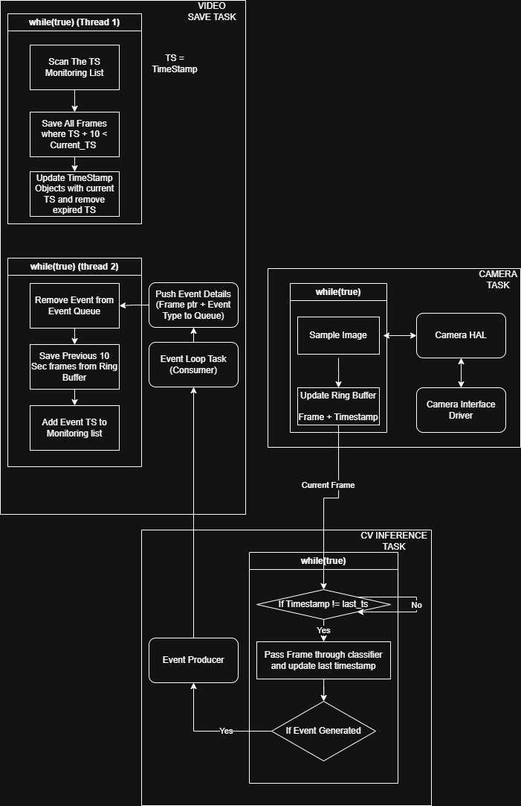

# camera-incident-clip-saving

## Introduction
Dear Netradyne Team, after some research about Netradyne's product suite, I have decided to apply my system design skills to solve a specific problem that I figured you would have encountered (and potentially solved). The purpose of this architecture doc is to help you understand how I think about system architecture when given a problem statement.

## Problem Statement
Video recording from multiple vehicle cameras of a fleet monitoring system needs to be saved to cloud only when an incident (indicated by AI Model) occurs. This methodology helps to optimize bandwidth used by each node (Edge AI Camera) and storage space on server.

## Solution
The following system is designed to save the previous 10 seconds of video and next 10 seconds of video when an incident occurs on a specific camera.

Ring buffer of CAMERA TASK can be implemented in shared memory along with something like a mutex to allow for thread safe read/write between other tasks and CAMERA TASK.

A Pub - Sub system can be created using sockets between AI INFERENCE TASK and VIDEO SAVE TASK to facilitate event forwarding.

## Design Considerations
The following questions crossed my mind 
1. What if the camera FPS is much more than the AI INFERENCE throughput?
   Sol -> Process only current frame in AI INFERENCE (This helps to capture latest event)

2. What if multiple event occurs together or same event occurs multiple time?
   Sol -> Event consumer object maintains a queue of good enough size (defined by AI model throughput) so that multiple events can be received.
   SAVE VIDEO TASK processes each event and keeps it in a list for conducting next 10 sec frame acquisition. It deletes the list element after 10 sec passed. (TS    is expired).

3. What if we need to send data to cloud?
   Sol -> Save the data locally first anotated with uuid and send to cloud using a separate service (This will help to not compromise the SAVE Video TASK output)

## Shortcomings

I am also listing the known flaws of the design,

1. If Camera FPS is too high, the ring buffer will be overwritten very fast so last ten second image might not remain, the ring buffer size needs to be increased linerly if camera FPS is increased.

## Conclusion

I hope that this has helped to demonstrate my fit for the role, Looking forward to discussing potential improvements if I have the opportunity to join the team.

Thanks!

Danish Gandhi
   

